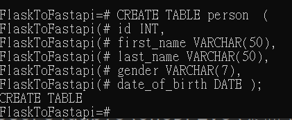
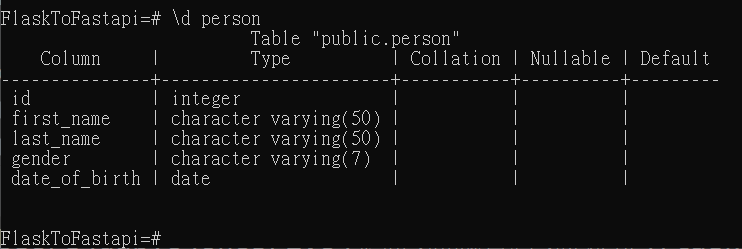
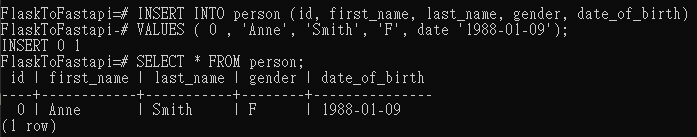
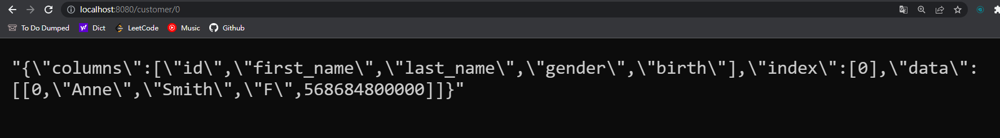

# Flask to Fastapi
Aimd to change the backend framework project from Flask to Fastapi.

## packages & tools
flask

fastapi

uvicorn

postgreSQL

psycopg2

pandas

docker


## Build Environment
### PostgreSQL setting  

create table  

  

see table schema  

  

insert data  

  


### Docker command
Use following command in ./fastapi  

Build  

```docker build -t fastapi .```

Run  

```docekr run -p 8080:8080 fastapi```

## Project Result

### API docs
connect to `http://127.0.0.1:8080/docs` and see API docs.  

### Response
